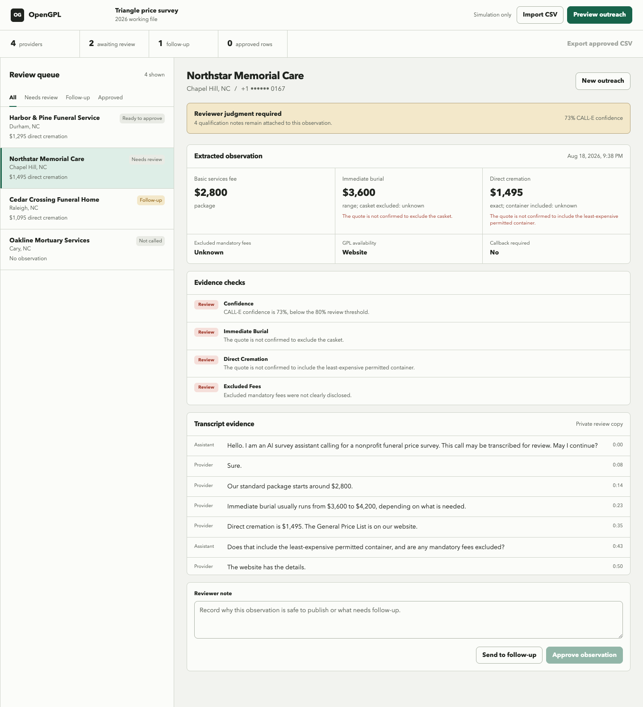

# OpenGPL

OpenGPL is a consent-first CALL-E workbench for nonprofit funeral price survey
teams. It turns a phone observation into a qualified, transcript-linked review
record. It does not treat a phone quote as a canonical General Price List.

**Live demo:** https://opengpl.vercel.app — simulation is the default and does
not place calls.



The current tracer bullet includes:

- browser-local provider queue and review state;
- CSV import and reviewer-approved CSV export;
- a no-call preview of destination, authorization, task, and result contract;
- realistic simulation fixtures for clear, ambiguous, and contradictory calls;
- transcript and structured-result cross-checks that can block publication;
- terminal-disposition checks that block contradictory outcomes such as a
  declined call extracted as `no_answer`;
- human approval or follow-up disposition; and
- server-only CALL-E call creation plus authenticated status reconciliation.

## Run locally

```bash
npm install
npm run dev
```

Open `http://localhost:3000`. Simulation is the default and cannot place a
phone call.

Run all checks:

```bash
npm run verify
```

## Enable the live prototype path

Copy `.env.example` to `.env.local` and set:

```text
CALLE_API_KEY=<server-side key>
OPENGPL_LIVE_MODE=operator-prototype
OPENGPL_ALLOWED_NUMBERS=+1...
```

Every live number must be explicitly allowlisted. A provider also needs
`authorization=authorized` in the imported CSV, and the operator must type the
exact confirmation shown in the preview. Demo-only and unauthorized rows
cannot enter the live path.

The server uses `@call-e/calle@0.7.0`. API keys never enter browser code. A
stable intent key is reused for retries of the same survey/provider operation.

## CSV columns

Required columns:

```text
name,locality,phone,authorization
```

`phone` must be E.164. `authorization` must be one of `authorized`,
`demo_only`, or `not_authorized`. `authorization_note` is optional but strongly
recommended.

## Known boundary

This is a local operator prototype, not a production calling service. Browser
state is durable on one device, but webhook ingestion and a server-side event
store are not implemented yet. Until those exist, the app reconciles live
results by reading the accepted call ID through the authenticated status API.
No consequential action is automatic.

## License

MIT. See `LICENSE`.
